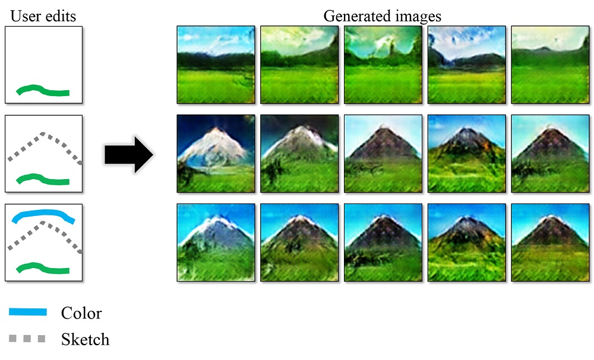

## iGAN: Interactive Image Generation via Generative Adversarial Networks

## Overview
iGAN (aka. interactive GAN) is the author's implementation of interactive image generation interface described in:  
"Generative Visual Manipulation on the Natural Image Manifold"   

Given a few user strokes, our system could produce photo-realistic samples that best satisfy the user edits at real-time. Our system is based on deep generative models such as Generative Adversarial Networks ([GAN](https://arxiv.org/abs/1406.2661)) and [DCGAN](https://github.com/Newmu/dcgan_code). The system serves the following two purposes:
* An intelligent drawing interface for automatically generating images inspired by the color and shape of the brush strokes.
* An interactive visual debugging tool for understanding and visualizing deep generative models. By interacting with the  generative model, a developer can understand what visual content the model can produce, as well as the limitation of the model.

